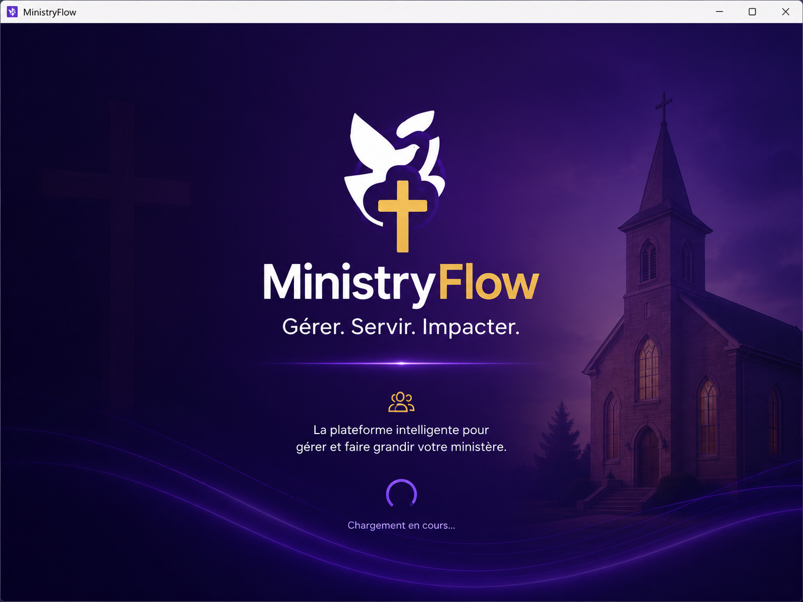

# **README — MinistryFlow**  
### *Plateforme moderne de gestion d’église, ministères et opérations pastorales*

---

<div align="center">
  
</div>

---

## Présentation du projet

**MinistryFlow** est une plateforme moderne conçue pour aider les églises à gérer leurs opérations administratives, ministérielles et communautaires.  
Elle centralise les informations, automatise les processus, facilite la communication et offre une vue d’ensemble claire de la vie de l’église.

MinistryFlow fait partie de l’écosystème technologique d’**API Business Technology**.

---

## Objectifs du système

MinistryFlow permet de :

- Gérer les membres et familles  
- Organiser les ministères et équipes  
- Planifier les événements et cultes  
- Suivre les présences et statistiques  
- Gérer les finances (dîmes, offrandes, dépenses)  
- Communiquer efficacement (SMS, email, notifications)  
- Centraliser documents, prédications et archives  
- Offrir un tableau de bord moderne et intuitif  

---

## Fonctionnalités principales

### Gestion des membres
- Fiches membres complètes  
- Familles et relations  
- Nouveaux convertis  
- Suivi pastoral  

### Gestion des ministères
- Chorale  
- Protocole  
- Intercession  
- Évangélisation  
- Jeunesse  
- Enfants  
- Femmes / Hommes  
- Groupes de maison  

### Gestion des événements
- Cultes  
- Réunions  
- Conférences  
- Retraites  
- Répétitions  
- Calendrier centralisé  

### Présences & statistiques
- Présence aux cultes  
- Présence aux ministères  
- Taux de participation  
- Croissance mensuelle  
- Rapports PDF  

### Finances
- Dîmes  
- Offrandes  
- Dépenses  
- Rapports financiers  
- Historique complet  

### Communication
- SMS  
- Email  
- Notifications internes  
- Messages ciblés  

### Documents & archives
- Prédications  
- Programmes  
- Rapports  
- Fichiers internes  

---

## Objectif du Projet

Le projet **MinistryFlow** vise à automatiser les processus administratifs des ministères, municipalités et institutions publiques.  
Il permet une gestion fluide des dossiers, workflows et décisions internes.

---

## Rôle dans l’Écosystème API Business Technology

Ce projet fait partie de la suite **GovTech Solutions**.  
Il occupe le rôle suivant :

- **Fonction technique :** Backend + Frontend + IA  
- **Responsabilité :**  
  - Automatisation des workflows  
  - Gestion des dossiers  
  - Tableaux de bord décisionnels  
  - Intégration avec MinistryFlow DevOps et MinistryFlow Dashboard

---

## Problème résolu

- Processus administratifs lents  
- Manque de traçabilité  
- Absence d’automatisation  
- Décisions basées sur des données incomplètes

---

## Utilisateurs ciblés

- Ministères  
- Municipalités  
- Écoles  
- Institutions publiques  
- ONG

---

## Intégration avec les autres services

- MinistryFlow DevOps  
- MinistryFlow Dashboard  
- Modules IA internes  
- Services API internes


## Architecture globale

```
MinistryFlow
│
├── Frontend (React / Next.js)
│   ├── Tableau de bord
│   ├── Membres
│   ├── Ministères
│   ├── Événements
│   ├── Finances
│   └── Communication
│
├── Desktop App (Electron)
│   ├── Version locale
│   ├── Accès fichiers
│   └── Notifications natives
│
├── Backend (Node.js / Express)
│   ├── API REST
│   ├── Gestion des membres
│   ├── Gestion des ministères
│   ├── Finances
│   ├── Événements
│   └── Sécurité & Authentification
│
├── Base de données (PostgreSQL)
│   ├── Membres
│   ├── Ministères
│   ├── Événements
│   ├── Finances
│   └── Documents
│
└── DevOps
    ├── GitLab CI/CD
    ├── Tests automatisés
    ├── SonarQube
    ├── Stryker
    ├── Monitoring
    └── Infrastructure sécurisée
```

---

## Technologies utilisées

### Frontend
- React  
- Next.js  
- TailwindCSS  

### Desktop
- Electron  

### Backend
- Node.js  
- Express  
- TypeScript  

### Base de données
- PostgreSQL  

### DevOps
- GitLab CI/CD  
- SonarQube  
- Stryker  
- Docker  
- Azure  

---

## Installation & Déploiement

### Backend
```bash
npm install
npm run build
npm start
```

### Frontend
```bash
npm install
npm run dev
```

### Desktop (Electron)
```bash
npm install
npm run electron
```

### Déploiement
- Pipeline GitLab CI/CD  
- Environnements : dev → staging → production  
- Déploiement sécurisé via Azure  

---

## Documentation API (aperçu)

### Membres
- `GET /members`  
- `POST /members/add`  
- `GET /members/:id`  

### Ministères
- `GET /ministries`  
- `POST /ministries/add`  

### Événements
- `GET /events`  
- `POST /events/create`  

### Finances
- `GET /finance/records`  
- `POST /finance/add`  

### Communication
- `POST /notifications/send`  

---

## Documentation Fonctionnelle / API

Cette section présente les fonctionnalités principales du projet ainsi que la structure générale de son API.

---

### 🔹 Endpoints principaux

| Méthode | Endpoint | Description |
|--------|----------|-------------|
| GET    | /resource | Récupération des données principales |
| POST   | /resource | Création d’une nouvelle ressource |
| PUT    | /resource/:id | Mise à jour d’une ressource existante |
| DELETE | /resource/:id | Suppression d’une ressource |

> Remplacer **resource** par le nom réel selon le projet  
> (ex : `/animals`, `/stocks`, `/alerts`, `/users`, etc.)

---

### 🔹 Paramètres importants

- **id** : Identifiant unique de la ressource  
- **token** : Jeton d’authentification (JWT)  
- **animalId / stockId / userId** : Identifiants spécifiques selon le projet  
- **limit / page** : Paramètres de pagination  
- **filter** : Filtrage des données  

---

### Réponses de l’API

- **200 – Succès**  
  La requête a été traitée correctement.

- **201 – Créé**  
  Une nouvelle ressource a été ajoutée.

- **400 – Erreur de validation**  
  Paramètres manquants ou invalides.

- **401 – Non authentifié**  
  Jeton invalide ou absent.

- **403 – Non autorisé**  
  L’utilisateur n’a pas les permissions nécessaires.

- **404 – Introuvable**  
  Ressource inexistante.

- **500 – Erreur serveur**  
  Problème interne du système.

---

### Sécurité

- **JWT** pour l’authentification  
- **RBAC** (Role-Based Access Control) pour la gestion des permissions  
- **Chiffrement** des données sensibles  
- **Audit logs** pour tracer les actions importantes  
- **Validation stricte** des entrées utilisateur  

---

### Modules / Fonctionnalités principales

- Fonctionnalité 1 : [Décrire la fonction principale du projet]  
- Fonctionnalité 2 : [Décrire une fonction secondaire]  
- Fonctionnalité 3 : [Décrire une interaction avec un autre service]  

> Remplacer ces lignes par les vraies fonctionnalités selon le repo.

---

### Intégration dans l’écosystème API Business Technology

Ce projet fait partie de l’écosystème global et interagit avec :

- [Nom du produit principal]  
- [Backend / Frontend / DevOps / IA / IoT]  
- [Autres services liés]  

---

## Testing & Quality (Modèle)

Ce dépôt inclut une structure de tests permettant de garantir la qualité du code et la stabilité du système.

### Types de tests
- Tests unitaires (Jest / Pytest)
- Tests d’intégration
- Tests UI (Cypress pour les frontends)
- Tests de performance (modèle)
- Tests de sécurité (modèle)

### Qualité du code
- Linting automatique (ESLint / Flake8)
- Formatage automatique (Prettier / Black)
- Analyse statique (modèle)

### Couverture de tests
Un rapport de couverture sera généré automatiquement via CI/CD.

### Objectif
Assurer un code stable, maintenable et conforme aux standards professionnels.
```

---

## CI/CD Pipeline (Modèle)

Ce dépôt inclut un pipeline CI/CD permettant d’automatiser les étapes de build, test et déploiement.

### Étapes du pipeline
- Build du projet
- Exécution des tests
- Analyse de qualité
- Génération des artefacts
- Déploiement automatique (modèle)

### Environnements
- Développement
- Staging
- Production

### Sécurité CI/CD
- Variables protégées
- Gestion des secrets
- Permissions d’accès aux pipelines

### Objectif
Automatiser le cycle de développement pour garantir rapidité, fiabilité et qualité.
```

---

## AI & Data (Modèle)

Ce dépôt inclut une structure dédiée aux modules IA et aux données utilisées pour l’entraînement.

### Structure des données
- Datasets bruts
- Datasets prétraités
- Labels / annotations
- Scripts de prétraitement

### Modèles IA
- Modèles de classification (modèle)
- Modèles de détection (modèle)
- Modèles de prédiction (modèle)

### Pipeline IA
- Prétraitement des données
- Entraînement du modèle
- Évaluation
- Export du modèle

### Objectif
Fournir une base solide pour l’intégration de l’intelligence artificielle dans le système.
```

## Roadmap

### 2026
- Version web complète  
- Version desktop Electron  
- Gestion finances v1  
- Communication v1  

### 2027
- IA prédictive (croissance, participation)  
- Automatisation des communications  
- Rapports intelligents  

### 2028
- Version entreprise  
- Multi‑églises  
- Intégration cloud complète  

---

## Sécurité & Confidentialité

Le module **MinistryFlow Backend** gère des données sensibles liées aux membres, aux ministères, aux finances, aux présences et aux événements d’église.  
La sécurité est donc une priorité absolue pour garantir la confidentialité et l’intégrité des informations.

### Principes de sécurité appliqués
- Authentification par jetons sécurisés (JWT)
- Gestion des permissions avancée (RBAC : pasteur, leader, administrateur, membre)
- Chiffrement des données sensibles (membres, finances, rapports)
- Protection contre les attaques API (OWASP, rate limiting, anti‑replay)
- Validation stricte des données envoyées par le frontend
- Journalisation des actions critiques (création de ministères, finances, rapports)
- Isolation des environnements (dev, staging, production)

### Confidentialité
- Aucune donnée réelle d’église n’est stockée dans ce dépôt
- Les identifiants des membres sont masqués dans les environnements de test
- Les systèmes réels respectent les normes canadiennes de protection des données (PIPEDA)
- Les données sensibles sont traitées uniquement dans des environnements sécurisés

MinistryFlow Backend garantit une gestion sécurisée, conforme et fiable des données d’église.
```

## Installation & Déploiement (Modèle)

Ce dépôt représente le backend du système **MinistryFlow**, responsable de la gestion des ministères, des membres, des événements, des présences et des finances.

### Prérequis
- Node.js (Express.js ou NestJS)
- PostgreSQL ou MongoDB
- Git
- Variables d’environnement pour la base de données et l’authentification

### Installation (modèle)
```bash
git clone https://gitlab.com/api-business-technology/ministryflow-backend
cd ministryflow-backend
```

### Déploiement (modèle)
- Configuration de la base de données
- Activation des modules d’authentification
- Déploiement sur un serveur cloud sécurisé
- Intégration avec MinistryFlow Frontend
- Mise en place des logs et alertes

Ce guide représente la structure générale du déploiement réel.
```
## oadmap (Modèle)

### Q1 — Fondation
- Architecture backend
- Structure API
- Documentation des endpoints

### Q2 — Modules principaux
- Gestion des membres
- Gestion des ministères
- Gestion des événements
- Gestion des présences

### Q3 — Modules avancés
- Finances (dîmes, offrandes, dépenses)
- Rapports PDF
- Communication (SMS, email, notifications)

### Q4 — Scalabilité
- Optimisation cloud
- Sécurité renforcée
- Intégration complète MinistryFlow

### Vision 2027
- IA pour l’analyse de croissance
- Automatisation des rapports d’église

### Vision 2030
- Plateforme d’église intelligente unifiée
- Gestion autonome des ministères et événements
```

---

## Sécurité & Confidentialité

Le module **MinistryFlow Frontend** est l’interface utilisateur permettant de gérer les membres, les ministères, les événements, les présences et les finances.  
Même si ce dépôt ne contient pas les données réelles, il représente une interface critique dans un système de gestion d’église.

### Principes de sécurité appliqués
- Communication sécurisée avec le backend (HTTPS / TLS)
- Gestion des permissions (RBAC : pasteur, leader, administrateur, membre)
- Protection contre les attaques frontales (XSS, CSRF, injections)
- Validation stricte des données reçues du backend
- Masquage des informations sensibles dans l’interface
- Journalisation des actions utilisateur (connexion, création d’événements, gestion des ministères)

### Confidentialité
- Aucune donnée réelle d’église n’est stockée dans ce dépôt
- Les identifiants des membres sont masqués dans les environnements de test
- Les systèmes réels respectent les normes canadiennes de protection des données (PIPEDA)
- Les données sensibles sont traitées uniquement dans des environnements sécurisés

MinistryFlow Frontend garantit une visualisation sécurisée et conforme des données d’église.
```

## Installation & Déploiement (Modèle)

Ce dépôt représente l’interface utilisateur du système **MinistryFlow**, permettant aux leaders et membres de consulter et gérer les ministères, événements, présences et finances.

### Prérequis
- Node.js (React / Next.js)
- Git
- Navigateur moderne
- Variables d’environnement pour la connexion au backend

### Installation (modèle)
```bash
git clone https://gitlab.com/api-business-technology/ministryflow-frontend
cd ministryflow-frontend
```

### Déploiement (modèle)
- Configuration de l’URL du backend
- Déploiement sur un hébergement cloud sécurisé
- Activation des modules d’affichage (membres, ministères, finances)
- Intégration avec les systèmes d’authentification
- Publication via CI/CD (GitLab)

Ce guide représente la structure générale du déploiement réel.
```

## Roadmap (Modèle)

### Q1 — Fondation
- Architecture frontend
- Structure du dashboard MinistryFlow
- Documentation des composants

### Q2 — Modules principaux
- Gestion des membres
- Gestion des ministères
- Gestion des événements
- Gestion des présences

### Q3 — Modules avancés
- Finances (dîmes, offrandes, dépenses)
- Rapports PDF
- Notifications (SMS, email)

### Q4 — Scalabilité
- Optimisation cloud
- Sécurité renforcée
- Intégration complète MinistryFlow

### Vision 2027
- Dashboard IA pour l’analyse de croissance
- Automatisation des rapports d’église

### Vision 2030
- Plateforme d’église intelligente unifiée
- Interface autonome pour la gestion des ministères
```

---

## Sécurité & Confidentialité

Le dépôt **MinistryFlow DevOps** regroupe les scripts, pipelines et configurations d’infrastructure liés au déploiement de MinistryFlow.  
Il représente la couche d’orchestration technique (CI/CD, infrastructure, monitoring) et doit respecter des standards élevés de sécurité.

### Principes de sécurité appliqués
- Gestion sécurisée des secrets (variables d’environnement, vault)
- Séparation des environnements (dev, staging, production)
- Contrôle d’accès aux pipelines (permissions GitLab / GitHub)
- Validation des artefacts avant déploiement (tests, lint, audit)
- Journalisation des déploiements et des changements d’infrastructure
- Conformité aux bonnes pratiques DevSecOps

### Confidentialité
- Aucune donnée réelle d’église n’est stockée dans ce dépôt
- Les secrets et clés d’accès ne sont jamais commités en clair
- Les systèmes réels utilisent des solutions de gestion de secrets dédiées

MinistryFlow DevOps garantit une orchestration sécurisée et contrôlée des déploiements MinistryFlow.
```

## Installation & Déploiement (Modèle)

Ce dépôt représente la couche DevOps de **MinistryFlow**, incluant les pipelines CI/CD, les scripts d’infrastructure et les configurations de déploiement.

### Prérequis
- Git
- Accès à une plateforme CI/CD (GitLab CI, GitHub Actions, Azure DevOps)
- Accès à l’infrastructure cible (cloud, conteneurs, VM)
- Gestion des secrets (vault, variables protégées)

### Installation (modèle)
```bash
git clone https://gitlab.com/api-business-technology/ministryflow-devops
cd ministryflow-devops
```

### Déploiement (modèle)
- Configuration des variables d’environnement (backend, frontend, base de données)
- Activation des pipelines CI/CD (build, test, déploiement)
- Déploiement sur l’infrastructure cible (cloud, conteneurs)
- Mise en place du monitoring et des logs

Ce guide représente la structure générale du déploiement réel de MinistryFlow via DevOps.
```
## Roadmap (Modèle)

### Q1 — Fondation DevOps
- Mise en place des pipelines CI/CD
- Structuration des scripts d’infrastructure
- Documentation des workflows

### Q2 — Automatisation
- Déploiement automatisé backend + frontend
- Tests automatisés (unitaires, intégration)
- Gestion des secrets et des environnements

### Q3 — Observabilité
- Monitoring (logs, métriques, alertes)
- Tableaux de bord de déploiement
- Audit des changements

### Q4 — Scalabilité
- Optimisation des déploiements cloud
- Résilience et haute disponibilité
- Intégration complète MinistryFlow

### Vision 2027
- DevOps entièrement automatisé pour MinistryFlow
- Intégration MLOps pour les futurs modules IA

### Vision 2030
- Plateforme d’église intelligente avec déploiement autonome
- Orchestration avancée des services MinistryFlow
```

---

## Licence

Ce projet est **UNLICENSED**.  
Aucune permission n’est accordée pour utiliser, copier, modifier ou distribuer ce logiciel sans autorisation explicite du propriétaire.

Tous droits réservés.  
© API Business Technology – Projet MinistryFlow

---

## Contact

**Fondateur & CEO : Pierre Richard Saint Louis**  
API Business Technology  
Ottawa, Ontario, Canada

--- 
- **Badges CI/CD**  

